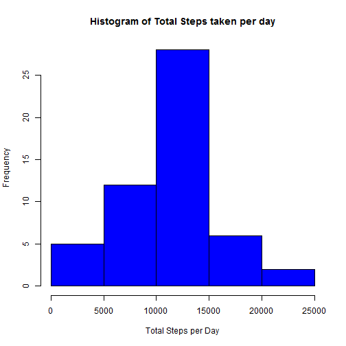
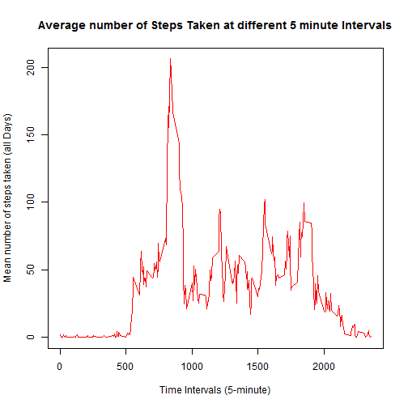
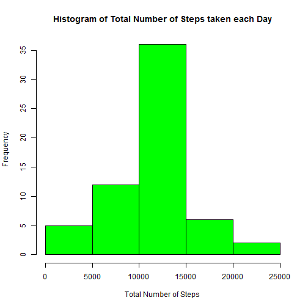

## Loading and preprocessing the data

Loading the data

```r
activity <- read.csv("activity.csv")
```

Converting the date from character format to Date format

```r
activity$date <- as.Date(activity$date)
```

## What is mean total number of steps taken per day?


```r
totalSteps <- aggregate(steps ~ date, data = activity, sum, na.rm = TRUE)
hist(totalSteps$steps, col = "blue", xlab = "Total Steps per Day", ylab = "Frequency", 
     main = "Histogram of Total Steps taken per day")
```

 

```r
showMean <- mean(totalSteps$steps)
showMedian <- median(totalSteps$steps)
```

## What is the average daily activity pattern?


```r
stepsInterval <- aggregate(steps ~ interval, data = activity, mean, na.rm = TRUE)
plot(steps ~ interval, data = stepsInterval, type = "l", xlab = "Time Intervals (5-minute)", 
     ylab = "Mean number of steps taken (all Days)", main = "Average number of Steps Taken at different 5 minute Intervals", 
     col = "red")
```

 

.Which 5-minute interval, on average across all the days in the dataset, contains the maximum number of steps?

```r
showStepInterval <- stepsInterval[which.max(stepsInterval$steps), ]$interval
```
.It is the 835 interval.

## Imputing missing values

.Calculate and report the total number of missing values in the dataset (i.e. the total number of rows with NAs)


```r
showSum <- sum(is.na(activity))
```
Total 2304 rows are missing.


```r
interval2steps <- function(interval) {
        stepsInterval[stepsInterval$interval == interval, ]$steps
}
activityFilled <- activity
count = 0
for (i in 1:nrow(activityFilled)) {
        if (is.na(activityFilled[i, ]$steps)) {
                activityFilled[i, ]$steps <- interval2steps(activityFilled[i, ]$interval)
                count = count + 1
        }
}
cat("Total ", count, "NA values were filled.\n")
```

```
## Total  2304 NA values were filled.
```

```r
totalStepsPerDays <- aggregate(steps ~ date, data = activityFilled, sum)
hist(totalStepsPerDays$steps, col = "green", xlab = "Total Number of Steps", 
     ylab = "Frequency", main = "Histogram of Total Number of Steps taken each Day")
```

 

```r
mean(totalStepsPerDays$steps)
```

```
## [1] 10766.19
```

```r
median(totalStepsPerDays$steps)
```

```
## [1] 10766.19
```

## Are there differences in activity patterns between weekdays and weekends?


```r
activityFilled$day = ifelse(as.POSIXlt(as.Date(activityFilled$date))$wday%%6 == 
                                    0, "weekend", "weekday")
# For Sunday and Saturday : weekend, Other days : weekday
activityFilled$day = factor(activityFilled$day, levels = c("weekday", "weekend"))
stepsInterval2 = aggregate(steps ~ interval + day, activityFilled, mean)
library(lattice)
xyplot(steps ~ interval | factor(day), data = stepsInterval2, aspect = 1/2, 
       type = "l")
```

 
